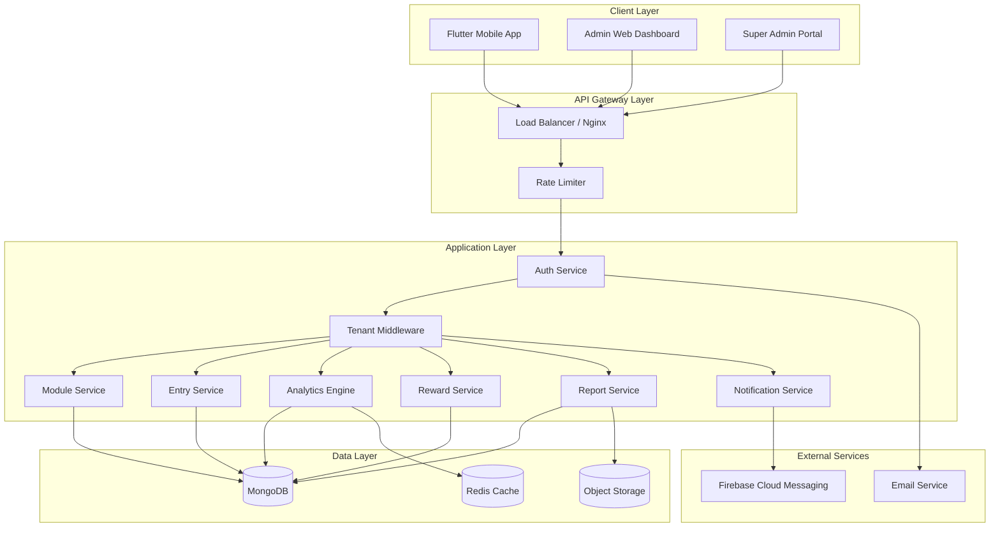
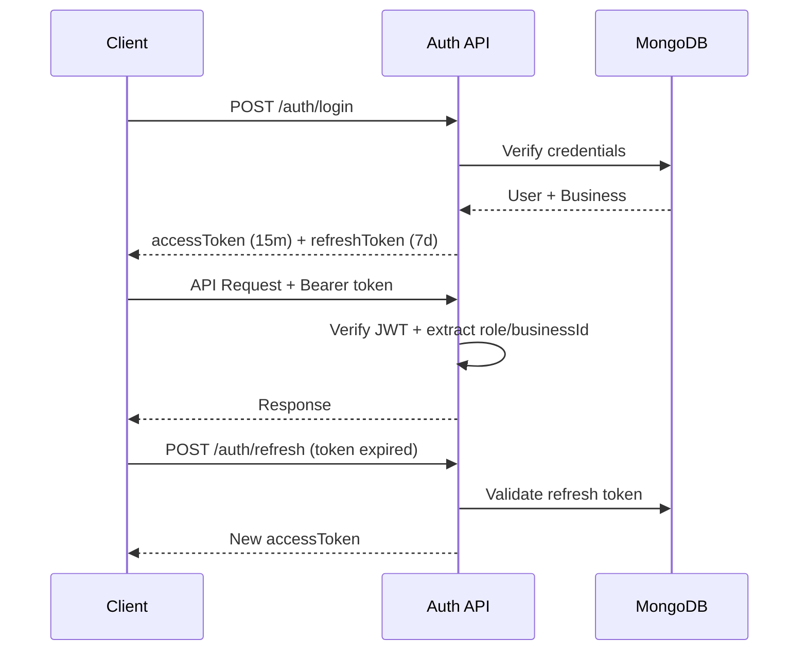

# System Architecture

## Overview

DigiTracker is a modular, multi-tenant SaaS platform built for horizontal scalability and future feature expansion.

## High-Level Architecture



## Multi-Tenant Strategy

**Approach:** Shared database with tenant isolation via `businessId` on every document.

| Aspect | Implementation |
|--------|----------------|
| Isolation | `businessId` field on all tenant-scoped collections |
| Indexing | Compound indexes: `{ businessId: 1, ... }` |
| Middleware | `tenantMiddleware` injects `businessId` from JWT |
| Super Admin | Bypasses tenant filter with explicit `businessId` param |
| Subscriptions | Plan limits enforced at service layer |

## Backend Architecture (MVC + Repository Pattern)

```
Request → Router → Middleware → Controller → Service → Repository → Model → MongoDB
                                    ↓
                               Validator
```

### Layers

| Layer | Responsibility |
|-------|----------------|
| **Routes** | HTTP endpoint definitions |
| **Middleware** | Auth, tenant, validation, error handling |
| **Controllers** | Request/response handling |
| **Services** | Business logic, orchestration |
| **Repositories** | Data access abstraction |
| **Models** | Mongoose schemas |
| **Validators** | Joi request validation |

## Authentication Flow



## Module System Design

Modules are fully dynamic — no code changes required for new tracking channels.

```
Module
├── name, slug, icon, color
├── fields[] (dynamic)
│   ├── name, slug, type, required, options
│   └── validation rules
├── isDefault (system modules)
└── isActive
```

Default modules (Instagram, WhatsApp) are seeded. Business owners create custom modules via admin dashboard.

## Analytics Engine

The analytics service computes growth metrics on-demand with optional Redis caching:

| Period | Calculation |
|--------|-------------|
| Daily | `(today - yesterday) / yesterday × 100` |
| Weekly | Compare current week avg vs previous week |
| Monthly | Compare current month vs previous month |
| Quarterly | 3-month rolling comparison |
| Yearly | Year-over-year comparison |

**Insights generated:**
- Fastest/slowest growing channel
- Best week/month
- Highest engagement day
- Consistency score (entry frequency)

## Reward System

| Action | Points |
|--------|--------|
| Daily entry submission | 10 |
| 7-day streak bonus | 50 |
| 30-day streak bonus | 200 |
| Same-day edit (accuracy) | 5 |

Champions: Weekly, Monthly, Quarterly based on total points.

## Scalability Considerations

| Feature | Design |
|---------|--------|
| Unlimited businesses | Horizontal API scaling behind load balancer |
| Branch management | `branches[]` on Business model |
| Feature toggles | `features` object on Subscription plan |
| White label | `branding` config per business |
| AI Analytics | Analytics service interface ready for ML pipeline |
| API Integrations | Module `source: 'api'` field for future auto-sync |

## Security

- bcrypt password hashing (12 rounds)
- JWT with short-lived access tokens
- Refresh token rotation
- Rate limiting on auth endpoints
- Helmet security headers
- CORS whitelist
- Input validation on all endpoints
- Audit logs for entry modifications

## Future Integration Points

```
┌──────────────────────────────────────────┐
│           Integration Hub (Future)        │
├──────────┬──────────┬──────────┬─────────┤
│ Instagram│ WhatsApp │   CRM    │   ERP   │
│   API    │ Business │  (HubSpot│ (SAP/   │
│          │   API    │  Salesforce)│ Oracle)│
└──────────┴──────────┴──────────┴─────────┘
```

Each integration will write to the same Entry collection via a sync service, preserving the module-based architecture.
