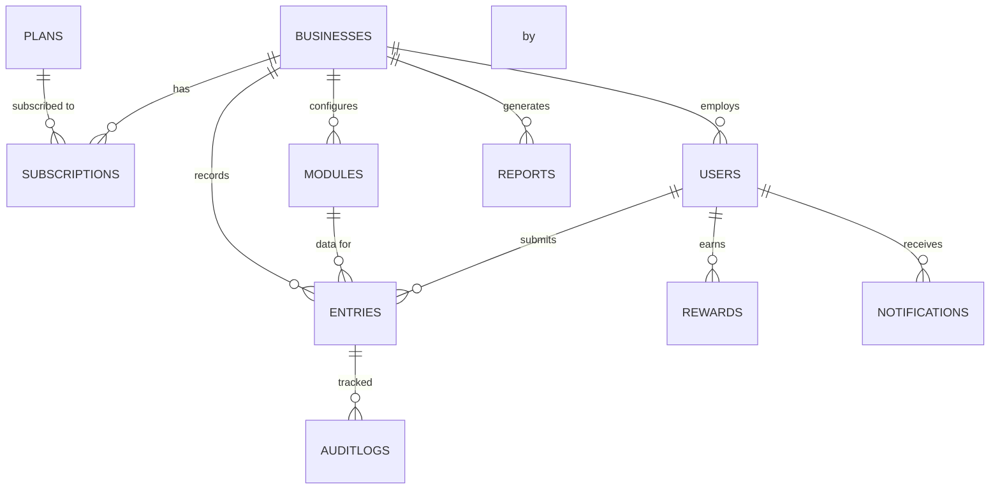

# MongoDB Database Schema

## Collections Overview

| Collection | Purpose | Tenant Scoped |
|------------|---------|---------------|
| `users` | All platform users | Yes (except super_admin) |
| `businesses` | Business workspaces | No (root entity) |
| `modules` | Tracking modules | Yes |
| `entries` | Daily metric entries | Yes |
| `auditlogs` | Entry change history | Yes |
| `rewards` | Staff reward records | Yes |
| `notifications` | Push/in-app notifications | Yes |
| `reports` | Generated report metadata | Yes |
| `subscriptions` | Business subscription plans | Yes |
| `plans` | Available SaaS plans | No (global) |
| `refreshtokens` | JWT refresh tokens | No |

## Entity Relationship Diagram



## Schema Definitions

### Users

```javascript
{
  _id: ObjectId,
  businessId: ObjectId,          // null for super_admin
  email: String,                 // unique, indexed
  password: String,              // bcrypt hashed
  firstName: String,
  lastName: String,
  role: Enum['super_admin', 'business_owner', 'staff'],
  avatar: String,
  phone: String,
  isActive: Boolean,
  rewardPoints: Number,
  currentStreak: Number,
  longestStreak: Number,
  lastEntryDate: Date,
  fcmToken: String,
  passwordResetToken: String,
  passwordResetExpires: Date,
  createdAt: Date,
  updatedAt: Date
}
// Indexes: { email: 1 }, { businessId: 1, role: 1 }
```

### Businesses

```javascript
{
  _id: ObjectId,
  name: String,
  slug: String,                // unique
  type: String,                  // gym, restaurant, etc.
  logo: String,
  address: {
    street: String,
    city: String,
    state: String,
    country: String,
    zipCode: String
  },
  contactNumber: String,
  email: String,
  timezone: String,              // e.g. 'Asia/Kolkata'
  branding: {
    primaryColor: String,
    secondaryColor: String,
    logoUrl: String
  },
  settings: {
    entryReminderTime: String,   // '09:00'
    weekStartsOn: Number,        // 0=Sunday, 1=Monday
    currency: String,
    dateFormat: String
  },
  branches: [{
    name: String,
    address: String,
    isActive: Boolean
  }],
  isActive: Boolean,
  onboardingCompleted: Boolean,
  createdAt: Date,
  updatedAt: Date
}
// Indexes: { slug: 1 }, { email: 1 }
```

### Modules

```javascript
{
  _id: ObjectId,
  businessId: ObjectId,
  name: String,                  // 'Instagram'
  slug: String,
  description: String,
  icon: String,                  // icon name or URL
  color: String,                 // hex color
  fields: [{
    _id: ObjectId,
    name: String,                // 'Followers'
    slug: String,                // 'followers'
    type: Enum['number', 'text', 'date', 'dropdown', 'boolean', 'currency', 'percentage'],
    required: Boolean,
    options: [String],           // for dropdown type
    defaultValue: Mixed,
    order: Number,
    isActive: Boolean
  }],
  isDefault: Boolean,
  isActive: Boolean,
  source: Enum['manual', 'api'], // future: auto-sync
  createdBy: ObjectId,
  createdAt: Date,
  updatedAt: Date
}
// Indexes: { businessId: 1, slug: 1 }, { businessId: 1, isActive: 1 }
```

### Entries

```javascript
{
  _id: ObjectId,
  businessId: ObjectId,
  moduleId: ObjectId,
  userId: ObjectId,              // staff who submitted
  entryDate: Date,               // the date metrics are for
  values: [{
    fieldId: ObjectId,
    fieldSlug: String,
    value: Mixed                   // number, string, boolean, etc.
  }],
  notes: String,
  isEdited: Boolean,
  editCount: Number,
  createdAt: Date,
  updatedAt: Date
}
// Indexes: { businessId: 1, moduleId: 1, entryDate: -1 }
//          { businessId: 1, userId: 1, entryDate: -1 }
//          { businessId: 1, moduleId: 1, entryDate: 1 } unique per day
```

### Audit Logs

```javascript
{
  _id: ObjectId,
  businessId: ObjectId,
  entryId: ObjectId,
  userId: ObjectId,
  action: Enum['create', 'update', 'delete'],
  previousValues: Mixed,
  newValues: Mixed,
  ipAddress: String,
  createdAt: Date
}
// Indexes: { businessId: 1, entryId: 1 }, { businessId: 1, createdAt: -1 }
```

### Rewards

```javascript
{
  _id: ObjectId,
  businessId: ObjectId,
  userId: ObjectId,
  type: Enum['daily_entry', 'streak_bonus', 'weekly_champion', 'monthly_champion', 'quarterly_champion', 'accuracy'],
  points: Number,
  description: String,
  period: String,                // '2026-W24', '2026-06'
  createdAt: Date
}
// Indexes: { businessId: 1, userId: 1 }, { businessId: 1, period: 1 }
```

### Notifications

```javascript
{
  _id: ObjectId,
  businessId: ObjectId,
  userId: ObjectId,
  type: Enum['entry_reminder', 'weekly_analytics', 'monthly_report', 'reward_achievement', 'system'],
  title: String,
  body: String,
  data: Mixed,
  isRead: Boolean,
  sentAt: Date,
  createdAt: Date
}
// Indexes: { businessId: 1, userId: 1, isRead: 1 }
```

### Reports

```javascript
{
  _id: ObjectId,
  businessId: ObjectId,
  generatedBy: ObjectId,
  type: Enum['daily', 'weekly', 'monthly', 'quarterly', 'yearly', 'custom'],
  period: { start: Date, end: Date },
  format: Enum['pdf', 'excel', 'csv'],
  fileUrl: String,
  status: Enum['pending', 'completed', 'failed'],
  metadata: Mixed,
  createdAt: Date
}
// Indexes: { businessId: 1, createdAt: -1 }
```

### Plans

```javascript
{
  _id: ObjectId,
  name: String,                  // 'Starter', 'Professional', 'Enterprise'
  slug: String,
  price: Number,
  currency: String,
  interval: Enum['monthly', 'yearly'],
  features: {
    maxStaff: Number,
    maxModules: Number,
    maxBranches: Number,
    analytics: Boolean,
    reports: Boolean,
    customModules: Boolean,
    rewards: Boolean,
    whiteLabel: Boolean,
    apiAccess: Boolean,
    prioritySupport: Boolean
  },
  isActive: Boolean,
  createdAt: Date
}
```

### Subscriptions

```javascript
{
  _id: ObjectId,
  businessId: ObjectId,
  planId: ObjectId,
  status: Enum['active', 'cancelled', 'expired', 'trial'],
  startDate: Date,
  endDate: Date,
  trialEndsAt: Date,
  createdAt: Date,
  updatedAt: Date
}
// Indexes: { businessId: 1 }, { status: 1, endDate: 1 }
```

### Refresh Tokens

```javascript
{
  _id: ObjectId,
  userId: ObjectId,
  token: String,
  expiresAt: Date,
  createdAt: Date
}
// Indexes: { token: 1 }, { userId: 1 }, TTL on expiresAt
```

## Indexing Strategy

All tenant-scoped queries include `businessId` as the leading index field for efficient partition-like access patterns.

Compound unique constraint on entries prevents duplicate daily submissions:
```
{ businessId: 1, moduleId: 1, entryDate: 1 } — unique
```
