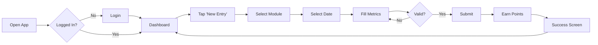
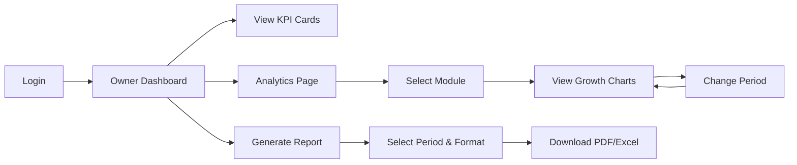
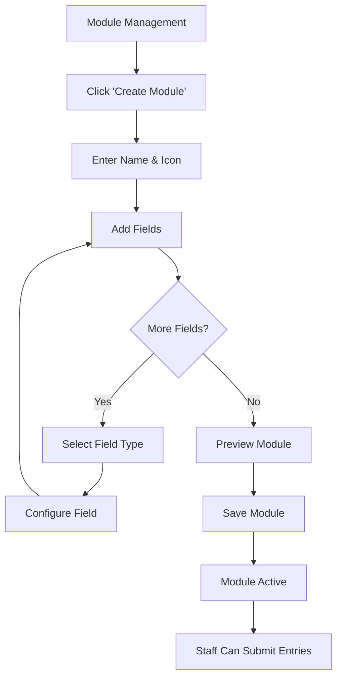
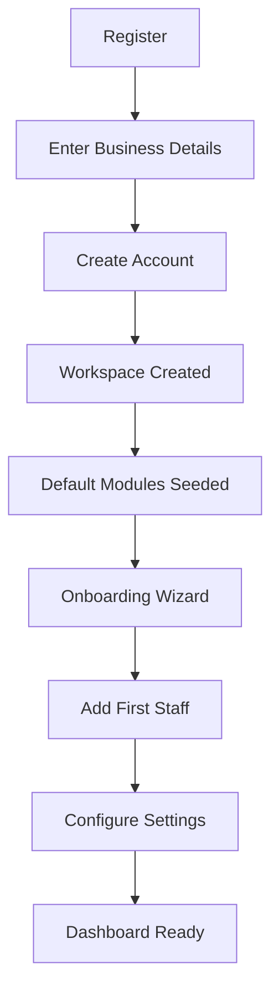

# Screens, User Flows & Wireframes

## Screen List

### Mobile App — Staff

| # | Screen | Description |
|---|--------|-------------|
| 1 | Splash | App logo, auth check |
| 2 | Login | Email/password login |
| 3 | Forgot Password | Email input for reset link |
| 4 | Reset Password | New password form |
| 5 | Dashboard | Today's tasks, streak, quick stats |
| 6 | Module Select | Grid of active modules |
| 7 | Entry Form | Dynamic fields based on module |
| 8 | Entry Success | Confirmation with points earned |
| 9 | My History | Past submissions list |
| 10 | Entry Detail | View/edit same-day entry |
| 11 | Rewards | Points, badges, streak info |
| 12 | Leaderboard | Staff rankings |
| 13 | Notifications | Notification list |
| 14 | Profile | User info, settings, logout |

### Mobile App — Business Owner

| # | Screen | Description |
|---|--------|-------------|
| 15 | Owner Dashboard | KPIs, charts overview |
| 16 | Analytics | Growth charts per module |
| 17 | Insights | AI-style insight cards |
| 18 | Staff Performance | Per-staff metrics |
| 19 | Reports | Generate & download |

### Admin Web Dashboard

| # | Screen | Description |
|---|--------|-------------|
| 1 | Login | Admin authentication |
| 2 | Dashboard | KPI cards, charts, insights |
| 3 | Staff List | Table with actions |
| 4 | Add/Edit Staff | Staff form modal |
| 5 | Module List | Module cards grid |
| 6 | Module Builder | Create/edit with dynamic fields |
| 7 | Analytics Overview | Multi-module charts |
| 8 | Analytics Detail | Single module deep dive |
| 9 | Leaderboard | Staff rankings table |
| 10 | Rewards Config | Point rules settings |
| 11 | Reports | Generate & history |
| 12 | Business Settings | Profile, branding, notifications |
| 13 | Super Admin: Businesses | All businesses table |
| 14 | Super Admin: Plans | Subscription plan management |

---

## User Flow — Staff Daily Entry



## User Flow — Business Owner Analytics



## Admin Flow — Custom Module Creation



## Onboarding Flow — New Business



---

## UI Wireframes

### Mobile — Dashboard (Staff)

```
┌─────────────────────────────┐
│  ☰  DigiTracker      🔔 👤 │
├─────────────────────────────┤
│                             │
│  Good morning, Jane! 👋     │
│                             │
│  ┌─────────┐ ┌─────────┐   │
│  │ 🔥 12   │ │ ⭐ 450  │   │
│  │ Streak  │ │ Points  │   │
│  └─────────┘ └─────────┘   │
│                             │
│  Today's Entries            │
│  ┌─────────────────────┐   │
│  │ 📸 Instagram    ○  │   │
│  │ 💬 WhatsApp     ✓  │   │
│  │ 📺 YouTube      ○  │   │
│  └─────────────────────┘   │
│                             │
│  ┌─────────────────────┐   │
│  │   + New Entry        │   │
│  └─────────────────────┘   │
│                             │
├─────────────────────────────┤
│  🏠   📝   🏆   👤        │
│ Home Entry Reward Profile   │
└─────────────────────────────┘
```

### Mobile — Entry Form

```
┌─────────────────────────────┐
│  ←  Instagram Entry         │
├─────────────────────────────┤
│                             │
│  Date: [ June 15, 2026  📅] │
│                             │
│  Followers *                │
│  ┌─────────────────────┐   │
│  │ 1,500               │   │
│  └─────────────────────┘   │
│                             │
│  Accounts Reached *         │
│  ┌─────────────────────┐   │
│  │ 5,000               │   │
│  └─────────────────────┘   │
│                             │
│  Profile Visits             │
│  ┌─────────────────────┐   │
│  │ 320                 │   │
│  └─────────────────────┘   │
│                             │
│  Notes (optional)           │
│  ┌─────────────────────┐   │
│  │                     │   │
│  └─────────────────────┘   │
│                             │
│  ┌─────────────────────┐   │
│  │     Submit Entry     │   │
│  └─────────────────────┘   │
└─────────────────────────────┘
```

### Admin — Dashboard

```
┌──────┬──────────────────────────────────────────────┐
│      │  Dashboard                    🔔  John Doe ▾ │
│  📊  ├──────────────────────────────────────────────┤
│ Dash │                                              │
│      │  ┌────────┐ ┌────────┐ ┌────────┐ ┌──────┐│
│  👥  │  │Modules │ │ Staff  │ │Entries │ │Best  ││
│Staff │  │   5    │ │   12   │ │  340   │ │+15.2%││
│      │  └────────┘ └────────┘ └────────┘ └──────┘│
│  📦  │                                              │
│Module│  ┌────────────────────┐ ┌─────────────────┐│
│      │  │  Growth Trends      │ │  Insights       ││
│  📈  │  │  ╱‾‾╲              │ │  🚀 Instagram   ││
│Analy │  │ ╱    ╲___           │ │  Fastest +22.5% ││
│      │  │╱                  │ │  📅 Best Week   ││
│  🏆  │  └────────────────────┘ │  W23: +18%      ││
│Reward│                         └─────────────────┘│
│      │  ┌────────────────────────────────────────┐│
│  📄  │  │  Staff Leaderboard                      ││
│Report│  │  1. Jane Smith    450pts  🔥15        ││
│      │  │  2. Mike Johnson  380pts  🔥12        ││
│  ⚙️  │  │  3. Sarah Lee     320pts  🔥8         ││
│Setting│  └────────────────────────────────────────┘│
└──────┴──────────────────────────────────────────────┘
```

### Admin — Module Builder

```
┌──────────────────────────────────────────────┐
│  Create Custom Module                         │
├──────────────────────────────────────────────┤
│                                               │
│  Module Name: [ YouTube Channel          ]   │
│  Icon: [📺]  Color: [#FF0000]               │
│  Description: [ Track YouTube metrics     ]   │
│                                               │
│  Fields                          [+ Add Field]│
│  ┌──────────────────────────────────────────┐│
│  │ ≡ Subscribers    number    required  ✏️ 🗑││
│  │ ≡ Views          number    required  ✏️ 🗑││
│  │ ≡ Watch Time     number    optional  ✏️ 🗑││
│  │ ≡ Monetized      boolean   optional  ✏️ 🗑││
│  └──────────────────────────────────────────┘│
│                                               │
│  [ Cancel ]              [ Save Module ]      │
└──────────────────────────────────────────────┘
```
